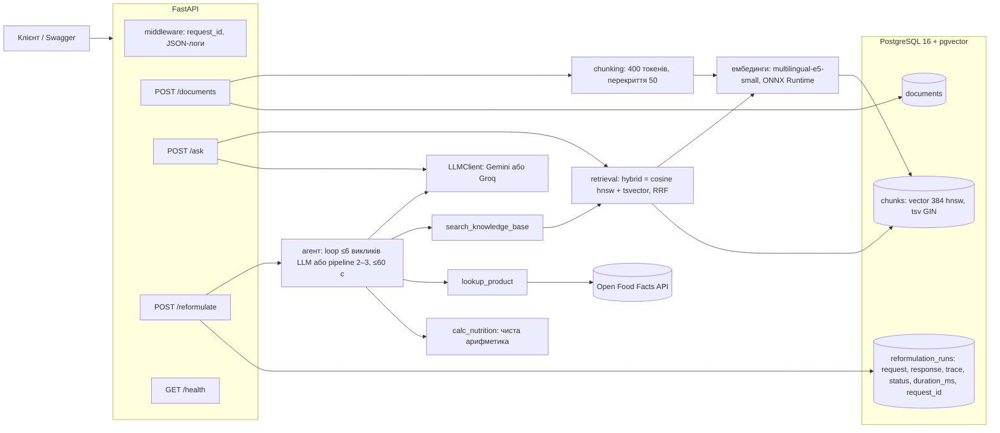

# Reformulation Assistant

[](https://github.com/Nikita-tg-python/reformulation-assistant/actions/workflows/ci.yml)

HTTP-сервіс для харчової R&D. Технолог подає рецептуру й ціль: прибрати алерген, знизити цукор або зробити продукт веганським. Сервіс пропонує заміни інгредієнтів із посиланнями на внутрішні документи та Open Food Facts і показує нутрієнти на 100 г до та після.

Пет-проєкт на один робочий день під вакансію Backend & AI Engineer. Стек: Python 3.12, FastAPI, PostgreSQL + pgvector, RAG, агент з tool calling, Docker. Повна постановка задачі лежить у [docs/task.docx](docs/task.docx).

## Для кого і що вміє

- **Технолог R&D.** `POST /reformulate` повертає заміни, алергени до/після, нутрієнти до/після і `trace`: список усіх викликів інструментів агента.
- **Будь-хто в команді.** `POST /ask` відповідає на питання про інгредієнти лише з бази знань і наводить джерела. Якщо відповіді в документах немає, сервіс так і каже: «в базі знань немає даних».
- **Той, хто наповнює базу.** `POST /documents` або `make ingest` додають документи, повторний інгест того самого `doc_id` замінює чанки, а не дублює їх.

Фронтенду немає, для демо є Swagger UI на http://localhost:8000/docs.

## Архітектура



- `app/llm/`: провайдер LLM сховано за інтерфейсом `LLMClient` з методами `complete` і `complete_with_tools`, обирається змінною `LLM_PROVIDER` (за замовчуванням `groq`: на free tier він стабільніший). `FakeLLM` використовується в тестах.
- `app/agent/`: цикл tool calling на ~75 рядків без фреймворків, три інструменти і промпт.
- `migrations/*.sql`: ідемпотентні міграції, застосовуються на старті під advisory lock.

## Запуск за 3 команди

Потрібні лише Docker і `make`. uv на машині не потрібен, усе працює в контейнерах.

```bash
cp .env.example .env   # вписати GROQ_API_KEY (безкоштовно, без картки: https://console.groq.com/keys)
make up                # збирає образ, піднімає api + db, чекає /health
make ingest            # заливає 20 документів із data/corpus/ у базу знань
```

Без `make`: `docker compose up -d --build`, потім `docker compose exec api python -m app.ingest data/corpus/`.

Решта команд: `make test` (pytest без ключів і без інтернету, разом з інтеграційними тестами на базі compose; у CI на GitHub Actions ті самі тести йдуть проти service-контейнера pgvector, без жодного пропущеного), `make lint`, `make logs`, `make down`, `make clean` (видаляє й дані). Повний список: `make help`.

`/health` і `/documents` працюють і без ключа LLM. Без ключа `/ask` і `/reformulate` повертають `503 llm_not_configured`.

## Ендпоінти

```bash
# стан сервісу, бази і провайдера LLM
curl -s localhost:8000/health
# {"status":"ok","db":"ok","llm_provider":"groq"}

# інгест одного документа (повтор із тим самим doc_id замінює чанки)
curl -s -X POST localhost:8000/documents -H 'Content-Type: application/json' -d '{
  "doc_id": "SPEC-099", "title": "Гороховий білок ізолят 80%", "doc_type": "ingredient_spec",
  "content": "## Функція в продукті\nПідвищує білок у рослинних йогуртах до 2-3 г на 100 г..."}'
# {"doc_id":"SPEC-099","chunks_created":1}

# RAG-відповідь із джерелами
curl -s -X POST localhost:8000/ask -H 'Content-Type: application/json' \
  -d '{"question": "Чим замінити яйце в бісквіті?", "top_k": 5}'
# {"answer":"Для бісквіту рекомендовано замінити яйце аквафабою – 45 г на одне яйце; це забезпечує піну
#   і не вносить алергенів...","sources":[{"doc_id":"SPEC-010",...},{"doc_id":"TRIAL-005",...},{"doc_id":"SPEC-011",...}]}

# питання поза корпусом: відмова, а не вигадка
curl -s -X POST localhost:8000/ask -H 'Content-Type: application/json' \
  -d '{"question": "Яка сьогодні погода в Києві?"}'
# {"answer":"В базі знань немає даних для відповіді на це питання.","sources":[]}

# агент переформулювання: три цілі на прикладі полуничного йогурту
BODY='"product_name":"Полуничний йогурт 2.5%","ingredients":[{"name":"молоко 2.5%","grams":800},{"name":"цукор","grams":90},{"name":"полуниця заморожена","grams":100},{"name":"закваска","grams":10}]'
curl -s -X POST localhost:8000/reformulate -H 'Content-Type: application/json' \
  -d "{$BODY,\"goal\":\"remove_allergen\",\"goal_params\":{\"allergen\":\"milk\"}}"
curl -s -X POST localhost:8000/reformulate -H 'Content-Type: application/json' \
  -d "{$BODY,\"goal\":\"reduce_sugar\",\"goal_params\":{\"percent\":30}}"
curl -s -X POST localhost:8000/reformulate -H 'Content-Type: application/json' \
  -d "{$BODY,\"goal\":\"make_vegan\",\"goal_params\":{}}"
```

Усі помилки мають один формат `{"error": {"code": "...", "message": "..."}}`. Помилки агента (`agent_timeout` 504, `agent_invalid_output` 502) додатково містять `trace`. Кожна відповідь має заголовок `X-Request-ID`, і той самий id є в JSON-логах і в `reformulation_runs`.

Перегляд запусків агента:

```bash
docker compose exec db psql -U postgres -d reformulation -c \
  "SELECT id, created_at, request->>'goal' AS goal, status, duration_ms, request_id,
          jsonb_array_length(trace) AS steps FROM reformulation_runs ORDER BY id DESC LIMIT 20"
```

## Як працює агент

Агент працює в одному з двох режимів. Режим задає змінна `AGENT_MODE` у `.env`.

| | `pipeline` (за замовчуванням) | `loop` |
|---|---|---|
| Хто викликає інструменти | код, у фіксованому порядку | модель сама (tool calling) |
| Викликів LLM на запит | 2, або 3 з повтором | до 6 (`AGENT_MAX_ITERATIONS`), на Groq 5–6 |
| Токенів Groq на запит | ~8 тис. | ~25–30 тис. |
| Типова тривалість на Groq | 4–7 с | 33–58 с з ліміту 60 с |
| Що може зламатися | вибір моделі (заміна, для якої немає даних) | квоти free tier, таймаут 60 с, збої генерації tool calls на Groq |
| Коли обирати | free tier (Groq 8000 токенів/хв і 200 тис./добу), демо | модель з паралельними tool calls і без жорстких квот |

Спільне для обох режимів:
- **Три інструменти.**

| Інструмент | Що робить |
|---|---|
| `search_knowledge_base(query, top_k)` | той самий пошук, що в `/ask` (hybrid за замовчуванням): один результат на документ (`top_k` ≤ 3), текст до 500 символів, для специфікацій також `nutrients_per_100g` |
| `lookup_product(name)` | Open Food Facts: нутрієнти, алергени (коди ЄС), інгредієнти; таймаут 5 с, кеш на один запуск, мережеві помилки повертаються як дані |
| `calc_nutrition(ingredients)` | зважене середнє kcal, білка, жиру, вуглеводів і цукру на 100 г, без LLM |

- **Ліміт часу 60 с** (`AGENT_TIMEOUT_SECONDS`). Перевищення дає 504 `agent_timeout` з уже зібраним trace.
- **Повтори запитів до провайдера** на 429 і 503 (з урахуванням `retry-after`), а на Groq ще й на 400 `output_parse_failed` і `tool_use_failed` (зіпсована генерація, новий семпл зазвичай проходить): не більше 2 повторів. Якщо провайдер просить чекати довше за 30 с (денний ліміт Groq: «try again in 12m54s»), повтору немає і клієнт одразу отримує 503 `llm_rate_limited`, а не 504 через хвилину очікування.
- **Кожен запуск записується в `reformulation_runs`,** включно з невдалими.

### Режим `loop`: вільний цикл tool calling

Модель отримує рецептуру, ціль і опис інструментів, сама їх викликає, поки не готова відповісти, і повертає JSON. Щоб вкластися в 6 викликів LLM і в квоти free tier:
- **факти про вихідні інгредієнти готує код** до першого виклику LLM: специфікацію й нутрієнти кожного інгредієнта (ітерація 0 у trace). Раніше модель витрачала на це 3–4 ходи з 6. Специфікація обирається за збігом назви із заголовком, а не першим результатом пошуку;
- **підказки про бюджет ходів**: перед 5-м ходом «виклич calc_nutrition зараз», перед 6-м «лише фінальний JSON»;
- **виклики інструментів одного ходу виконуються паралельно** (`asyncio.gather`), порядок у trace зберігається. Groq `gpt-oss-120b` паралельних tool calls не підтримує (за документацією Groq, так і в живих прогонах), тож виграш там лише на фактах (4 пошуки одночасно). Моделі з паралельними викликами (Gemini, Qwen на Groq) економлять цілі ходи;
- старі результати інструментів відправляються в історії стиснутими, повністю — лише в наступному виклику;
- формат відповіді описано в промпті компактно, а не згенерованою JSON-схемою;
- для Groq `gpt-oss` стоїть `reasoning_effort=low`.

Однаковий виклик двічі поспіль не виконується: агент примусово просить фінальну відповідь. Кожен запис trace містить `history_tokens`, щоб було видно, де впираємося в ліміт.

### Режим `pipeline`: фіксований порядок, 2 виклики LLM

У специфікації це запасний варіант на випадок нестабільного вільного циклу. На free tier він надійніший, тому стоїть за замовчуванням.
1. **Код** шукає в базі знань за ціллю, за кожним інгредієнтом (його власна специфікація) і «заміну для» кожного інгредієнта.
2. **LLM №1** обирає заміни, по одному інгредієнту на рядок; `original: null` означає добавку. Для кожного інгредієнта модель вказує, звідки взяти цифри.
3. **Код** перевіряє кожне число за джерелом: для специфікації — за її розділом «Нутрієнти на 100 г» (з урахуванням варіантів, як-от SPEC-009 А/Б), для решти шукає в Open Food Facts за англійською назвою. Число без джерела не приймається. Якщо даних бракує або вибір невалідний, LLM отримує другий шанс із переліком проблем.
4. **Код** двічі викликає `calc_nutrition`: для вихідного рецепта і для нового.
5. **LLM №2** пише фінальний JSON.

Модель у цьому режимі не викликає інструментів, лише повертає JSON. Тому збою розбору tool calls на Groq тут немає. Разом не більше 3 викликів LLM. Припущення коду (наприклад, «вихідна закваска — варіант А SPEC-009») записуються в trace.

### Перевірка відповіді (обидва режими)

Відповідь приймається, лише якщо:
- кожне джерело в `sources` справді повернули інструменти в цьому запуску, тому вигаданий `SPEC-014` не пройде;
- нутрієнти «до» пораховані `calc_nutrition` на вихідному рецепті (ті самі грами), а «після» — окремим викликом, без інгредієнтів із порожніми нутрієнтами;
- заміна без джерел має `confidence: "low"`, і для неї автоматично додається попередження в `warnings`;
- алергени процитованого продукту з OFF є в `allergens_after`, цільовий алерген прибрано, а у веганській версії немає тваринних алергенів.

Окремо `calc_nutrition` звіряє вхідні нутрієнти з `documents.nutrients`. Якщо інгредієнт названо як специфікацію в базі, а цифри інші, у `warnings` відповіді з'являється попередження (див. «Структуровані дані специфікацій»).

Інакше модель отримує текст помилки й один повтор, а друга невдача дає 502 `agent_invalid_output`.

**Живий trace, режим `pipeline`** (Groq `openai/gpt-oss-120b`, ціль `remove_allergen`, 4,6 с, 2 виклики LLM; з 9 пошуків показано 3):

```json
{"iteration": 1, "type": "tool_call", "call": "search_knowledge_base(query=\"рослинна заміна інгредієнтів з алергеном milk, …\", top_k=3)", "result": ["TRIAL-004 (0.9057)", "SPEC-001 (0.9038)", "SPEC-006 (0.902)"]}
{"iteration": 1, "type": "tool_call", "call": "search_knowledge_base(query=\"молоко 2.5%\", top_k=3)", "result": ["SPEC-001 (0.8471)", "TRIAL-001 (0.8396)", "TRIAL-004 (0.8341)"]}
{"iteration": 1, "type": "tool_call", "call": "search_knowledge_base(query=\"закваска\", top_k=3)", "result": ["SPEC-002 (0.836)", "SPEC-009 (0.84)", "GUIDE-001 (0.83)"]}
{"iteration": 1, "type": "llm_call", "purpose": "choose"}
{"iteration": 1, "type": "choice", "substitutions": ["молоко 2.5% -> кокосове молоко 2.5% жиру (800 g) ['TRIAL-001', 'SPEC-002']", "закваска -> закваска рослинна DVS (10 g) ['SPEC-009']"]}
{"iteration": 2, "type": "tool_call", "call": "lookup_product(name=\"frozen strawberries\")", "result": {"source_id": "OFF:9551014450028", "product_name": "frozen strawberry", "allergens": []}}
{"iteration": 2, "type": "tool_call", "call": "calc_nutrition(ingredients=[{\"name\": \"молоко 2.5%\", \"grams\": 800.0, …}])", "result": {"per_100g": {"kcal": 78.2, "protein_g": 2.4, "fat_g": 2.1, "carbs_g": 13.7, "sugar_g": 13.7}}}
{"iteration": 2, "type": "tool_call", "call": "calc_nutrition(ingredients=[{\"name\": \"кокосове молоко 2.5% жиру\", \"grams\": 800.0, …}])", "result": {"per_100g": {"kcal": 62.1, "protein_g": 0.3, "fat_g": 2.1, "carbs_g": 11.8, "sugar_g": 10.8}}}
{"iteration": 2, "type": "llm_call", "purpose": "final"}
{"iteration": 2, "type": "final_answer"}
```

Гібридний пошук за запитом «закваска» ставить першим SPEC-002 (кокосове молоко згадує закваску), але вихідна закваска все одно отримала цифри SPEC-009: специфікацію оригіналу код обирає за назвою. Відповідь: молоко → кокосове молоко 2.5% жиру (`TRIAL-001`, `SPEC-002`), молочна закваска → рослинна DVS (`SPEC-009`); алергени `["milk"]` → `[]`; kcal 78.2 → 62.1, білок 2.4 → 0.3 г на 100 г.

**Живий trace, режим `loop`** (Groq, ціль `reduce_sugar` на 30%, 36,5 с, 5 викликів LLM; аргументи скорочено):

```json
{"iteration": 0, "type": "tool_call", "call": "search_knowledge_base(query=\"молоко 2.5%\", top_k=3)", "result": ["SPEC-001 (0.8471)", "TRIAL-001 (0.8396)", "TRIAL-004 (0.8341)"]}
{"iteration": 0, "type": "tool_call", "call": "search_knowledge_base(query=\"цукор\", top_k=3)", "result": ["GUIDE-002 (0.838)", "SPEC-006 (0.8449)", "SPEC-008 (0.8221)"]}
{"iteration": 1, "type": "tool_call", "call": "search_knowledge_base(query=\"sugar replacement low calorie erythritol yogurt formulation\", top_k=3)", "result": ["SPEC-007 (0.8337)", "TRIAL-004 (0.829)", "SPEC-008 (…)"]}
{"iteration": 2, "type": "tool_call", "call": "lookup_product(name=\"frozen strawberries\")", "result": {"source_id": "OFF:9551014450028", "product_name": "frozen strawberry", "allergens": []}}
{"iteration": 3, "type": "tool_call", "call": "calc_nutrition(ingredients=[{\"name\": \"молоко 2.5%\", \"grams\": 800, …}, {\"name\": \"цукор\", \"grams\": 90, …}, …])"}
{"iteration": 4, "type": "tool_call", "call": "calc_nutrition(ingredients=[… {\"name\": \"цукор\", \"grams\": 30, …}, …])"}
{"iteration": 5, "type": "final_answer", "history_tokens": 1771}
```

Ітерація 0 — це 4 пошуки фактів, які код робить паралельно до першого виклику LLM. Відповідь: цукор 90 г → 30 г цукру плюс еритрит (`SPEC-006`, `SPEC-007`, `TRIAL-004`); цукор 13.7 → 7.7 г на 100 г, kcal 78.2 → 54.2.

### Чесно про стан живого агента

- **`pipeline` на Groq:** усі три цілі дають 200 за 4–7 с і 2–3 виклики LLM (remove_allergen, make_vegan, reduce_sugar). Останній прогін після виправлення вибору специфікації — remove_allergen вище.
- **`loop` на Groq вкладається в 6 ітерацій, але впритул.** Прогін трьох цілей після KAN-9 дав 3 з 3 зі статусом 200 за 5–6 ітерацій і 33–58 с при ліміті 60 с. Фінальна перевірка (KAN-17) дала 1 з 3. У `remove_allergen` Groq повернув 400 `tool_use_failed` (модель дописала до назви інструмента `<|channel|>commentary`), тепер на цю помилку є повтор. `make_vegan` не вклався в 60 с на 3-й ітерації.
- **Квоти free tier — головне обмеження живих перевірок.** Запит `loop` коштує ~25–30 тис. токенів Groq, `pipeline` ~8 тис., а денний ліміт Groq — 200 тис. токенів за ковзні 24 години. Під час фінальної перевірки його вичерпали сьогоднішні прогони (використано 198 708 з 200 000), тому `pipeline` отримав 429. Квота Gemini на той момент теж була вичерпана. Повторна перевірка на `openai/gpt-oss-120b` чекає, поки ліміт відновиться.
- **Контрольний прогін на Groq `openai/gpt-oss-20b`** (ліміти Groq рахуються окремо для кожної моделі, тому ця модель мала квоту):

  | Ціль | `pipeline` | `loop` |
  |---|---|---|
  | remove_allergen | 200, 2,4 с | 504, 4 ітерації за 60 с |
  | reduce_sugar | 502: двічі не збіглася маса нової рецептури (937 г замість 1000 г), перевірка маси це відхилила | 504, 4 ітерації за 60 с |
  | make_vegan | 200, 2,9 с (модель зайво замінила ще й цукор на аллюлозу) | 200, 59,5 с, 5 ітерацій |

  Висновок: `pipeline` стабільний за часом, а помилки менш сильної моделі ловить перевірка. `loop` на free tier упирається в 60 с. Щоб він працював надійно, потрібні модель без жорсткого хвилинного ліміту або з паралельними tool calls, або більший `AGENT_TIMEOUT_SECONDS`.
- **Якість відповідей.** У `reduce_sugar` модель знижує цукор сильніше за ціль (13.7 → 7.7 г, тобто на 44% замість 30%) і інколи пише `warnings` англійською. Ліміти дозування (еритрит ≤ 8% маси) код поки не перевіряє, див. «Що б зробив далі». Нутрієнти й алергени специфікацій вже структуровані й перевіряються кодом.
- **`/ask` на живій моделі працює:** Groq відповідає за 1–2 с, з джерелами, а на питання поза корпусом чесно відмовляє.
- **Історія комітів.** План передбачав один коміт на задачу. Насправді KAN-9 і KAN-12 мають по два коміти (другий у KAN-12 — виправлення версії `setup-uv`, на якій падав CI), а KAN-14 має окремий фікс регресії, знайденої перевіркою з KAN-16. Історію не переписував, бо ці коміти вже в `main` і CI пройшов на них.

## Kubernetes (kind)

Маніфести лежать у [k8s/](k8s/) і збираються через kustomize, без Helm. Там Namespace, StatefulSet Postgres з PVC на 1 Гб і headless Service, Deployment api з однією реплікою і ClusterIP Service, а також Job для інжесту. ConfigMap і Secret генерує `kustomization.yaml`. Потрібні [kind](https://kind.sigs.k8s.io/) і `kubectl`.

```bash
make k8s-secrets                 # k8s/secrets.env: плейсхолдери + ключі LLM з локального .env
kind create cluster --name reformulation
docker build -t reformulation-assistant:local .
kind load docker-image reformulation-assistant:local --name reformulation
kubectl apply -k k8s/            # разом з Job інжесту: 20 документів
kubectl -n reformulation rollout status deployment/api --timeout=300s
kubectl -n reformulation port-forward svc/api 8000:8000   # в окремому терміналі
curl -s localhost:8000/health
# {"status":"ok","db":"ok","llm_provider":"groq"}
```

Те саме однією командою: `make k8s-up`. Вона ще й перезапускає Deployment, бо кожна збірка має той самий тег `:local` і `apply` сам нового образу не підхопить. Повторний інжест: `make ingest-k8s`. Прибрати все: `make k8s-down`.

- **Секрети.** `secretGenerator` читає `k8s/secrets.env`, а цей файл у `.gitignore`. `make k8s-secrets` створює його з [k8s/secrets.env.example](k8s/secrets.env.example), де лише плейсхолдери, і дописує `GROQ_API_KEY` та `GEMINI_API_KEY` з `.env`, нічого не виводячи. Напряму з `../.env` kustomize читати не дає, бо файли поза `k8s/` він відхиляє. До того ж так у кластер потрапляють лише ключі, без решти `.env`. Несекретні налаштування лежать у ConfigMap, серед них `AGENT_MODE=pipeline`. Імена ConfigMap і Secret мають хеш вмісту, тож після зміни значення Deployment перекочується сам.
- **Інжест як Job, а не `kubectl exec`.** Спершу був простіший варіант з `exec` у под api, але інжест завантажує власну копію ONNX-моделі (пік близько 1.5 ГіБ). Разом з api це перевищило ліміт у 2 ГіБ, і OOM-killer вбив api. Job отримує свій под і свою пам'ять. Інжест ідемпотентний, тому Job запускається при першому `apply`. Після завершення Job видаляється через 10 хвилин, бо специфікація Job незмінна і стара Job заважала б наступному `apply`.
- **Ресурси.** Api в compose займає близько 1.1 ГіБ, на старті до 1.5 ГіБ, тому requests 1 ГіБ, limits 2 ГіБ. З лімітом 1 ГіБ под падав з OOMKilled ще на старті.
- **Проби на `/health`.** Коли база недоступна, `/health` повертає 503. Readiness прибирає под із Service, liveness перезапускає його приблизно через 30 с. Перевірено так: після `kubectl scale statefulset/postgres --replicas=0` api перезапустився через ~25 с, а після повернення бази піднявся сам, і дані в PVC збереглися. Компроміс: перезапуск api базу не лагодить, тож окремий `/livez`, який не залежить від бази, був би чистішим. startupProbe дає до 60 с на завантаження моделі й міграції, а initContainer чекає на Postgres.

## Рішення і відхилення від спеки

- **Модель ембедингів: `intfloat/multilingual-e5-small`, а не `all-MiniLM-L6-v2`.** Корпус український, а MiniLM англомовний: на 8 контрольних питаннях правильний документ у топ-3 він знаходив у 4 випадках, e5 — у 8. MiniLM до того ж обрізає вхід на 256 токенах, менше за чанк на 400. Розмірність та сама, 384, тому схема БД не змінилася.
- **ONNX Runtime замість sentence-transformers і torch.** Ті самі ваги й та сама нарізка, вектори збігаються з sentence-transformers (cos = 1.000000 на всьому корпусі). Образ зменшився з 2.8 ГБ до ~1.3 ГБ.
- **«Токени» в нарізці — це токени токенайзера моделі, а не слова.** Ліміт моделі теж рахується в токенах. Для української одне слово дає ~2 токени в e5 і ~5 у MiniLM.
- **asyncpg з ручним SQL.** Запитів мало, і вони специфічні для pgvector (`<=>`, `ON CONFLICT`). ORM тут був би зайвим шаром.
- **hnsw, а не ivfflat.** hnsw можна створити на порожній таблиці, і він коректно росте при вставках. ivfflat рахує кластери під час створення індексу, тож на старті був би непридатний.
- **Друга міграція** `002_run_request_id.sql` зв'язує запуски агента з request_id у логах.
- **Гібридний пошук (`SEARCH_MODE=hybrid`, за замовчуванням).** Векторний топ-20 і повнотекстовий топ-20 (`websearch_to_tsquery('simple', …)`, індекс GIN, міграція `003_fulltext.sql`) зливаються через Reciprocal Rank Fusion з k=60. Конфігурація `simple` без стемінгу, бо українського словника в Postgres немає, зате коди на кшталт SPEC-001 чи KS-2 збігаються дослівно. У `tsv` доданий `doc_id` з вагою A, бо чанк ніколи не містить коду власного документа: код трапляється лише в документах, що на нього посилаються. `score` у відповідях лишився косинусною подібністю, а порядок задає RRF. Порівняння hit@3 (top-3 чанки, e5-small, корпус із 20 документів):

  | Набір | vector | hybrid |
  |---|---|---|
  | 8 контрольних питань природною мовою | 8/8 | 8/8 |
  | 7 запитів-кодів (SPEC-001, SPEC-004, SPEC-009, TRIAL-003, KS-2, SG-3, ER-ST) | 3/7 | 4/7 |

  Обмеження RRF з рівними вагами: на запит «SPEC-004» повнотекстовий пошук ставить SPEC-004 першим, але документи, що його цитують, є в обох списках і після злиття обходять його.
- **Оцінка якості RAG: `make eval`.** [eval/run.py](eval/run.py) створює тимчасову базу, інжестить корпус і ставить 10 питань з [eval/questions.jsonl](eval/questions.jsonl): 8 сформульовані іншими словами, ніж у документах, 2 є кодами документів. Для кожного питання рахується, чи потрапив очікуваний документ у топ-5 документів (recall@5), і MRR@5. Обидва режими пошуку, поріг recall@5 ≥ 0.8. Той самий прогін іде в CI окремим job `eval` після тестів, з кешем моделі. Останній результат:

  | Режим | recall@5 | MRR@5 | коди: recall@5 |
  |---|---|---|---|
  | vector | 0.90 | 0.59 | 1/2 |
  | hybrid | 1.00 | 0.69 | 2/2 |

  На 8 смислових питаннях ранги в обох режимах однакові. Різницю дають коди: «SPEC-001» vector знаходить на 5-му місці, hybrid на 1-му. «TRIAL-003» vector не знаходить зовсім, hybrid знаходить на 5-му.
- **Структуровані дані специфікацій (міграція `004_structured_specs.sql`).** Під час інжесту [app/specs.py](app/specs.py) розбирає в кожній `ingredient_spec` секції «Нутрієнти на 100 г» і «Алергени». `documents.nutrients` (JSONB) зберігає варіанти продукту: «Аквафаба», «SG-3», «Варіант А». `documents.allergens` зберігає коди ЄС усіх варіантів разом. Алергени визначаються за номером пункту додатку II Регламенту 1169/2011, а не за словами, бо «Кокос не належить до горіхів» інакше дав би `nuts`. `search_knowledge_base` повертає `allergens` поруч із `nutrients_per_100g`. `calc_nutrition` звіряє вхідні нутрієнти інгредієнта, названого як специфікація в базі (усі слова назви є в заголовку або в назві варіанта), з `documents.nutrients` з допуском 0.05. Розбіжності йдуть у `data_mismatches` результату, а у фінальній відповіді стають попередженням у `warnings`, а не помилкою: зіставлення за назвою нечітке, а відхилена відповідь коштує повтору з ліміту в 6 викликів LLM. Перша ж жива перевірка знайшла справжню помилку. Після переходу на гібридний пошук (KAN-14) пайплайн і цикл брали специфікацію оригіналу як перший результат із нутрієнтами, і «закваска» отримала цифри кокосового молока, бо його текст згадує закваску. Тепер специфікація обирається за збігом назви із заголовком.
- **Postgres на хості слухає порт 5433,** бо 5432 часто зайнятий локальним Postgres.

## Що б зробив далі

1. **Доменні ліміти як дані.** Нутрієнти й алергени специфікацій уже структуровані й перевіряються кодом. Наступний крок: ліміти дозування (наприклад, еритрит ≤ 8% маси), бо в живому прогоні модель його перевищила. Крім того, алергени варто зберігати по варіантах: зараз SPEC-012 має `gluten`, хоча її варіант SG-3 безглютеновий.
2. **Точні коди в пошуку.** Гібридний пошук знаходить лише частину запитів-кодів (див. обмеження RRF вище). Варіанти: додавати код і назву документа в текст перед ембедингом (contextual chunk headers) або окремо шукати документи, чий `doc_id` точно збігся із запитом.
3. **Більший eval-набір.** 10 питань мало для висновків: одне питання змінює recall на 0.1. Варто 50+ питань від технологів і окремо оцінювати відповіді `/ask`: чи правильні цитати і чи модель відмовляє, коли відповіді в корпусі немає.
4. **Деплой у хмару.** Образ у registry, керований Postgres з pgvector, секрети в secret manager замість `k8s/secrets.env`, окремий `/livez` для liveness.
