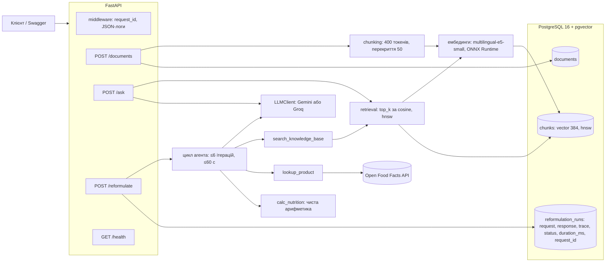

# Reformulation Assistant

HTTP-сервіс для харчової R&D. Технолог подає рецептуру й ціль: прибрати алерген, знизити цукор або зробити продукт веганським. Сервіс пропонує заміни інгредієнтів із посиланнями на внутрішні документи та Open Food Facts і показує нутрієнти на 100 г до та після.

Пет-проєкт на один робочий день під вакансію Backend & AI Engineer. Стек: Python 3.12, FastAPI, PostgreSQL + pgvector, RAG, агент з tool calling, Docker. Повна постановка задачі лежить у [docs/task.docx](docs/task.docx).

## Для кого і що вміє

- **Технолог R&D.** `POST /reformulate` повертає заміни, алергени до/після, нутрієнти до/після і `trace`: список усіх викликів інструментів агента.
- **Будь-хто в команді.** `POST /ask` відповідає на питання про інгредієнти лише з бази знань і наводить джерела. Якщо відповіді в документах немає, сервіс так і каже: «в базі знань немає даних».
- **Той, хто наповнює базу.** `POST /documents` або `make ingest` додають документи, повторний інгест того самого `doc_id` замінює чанки, а не дублює їх.

Фронтенду немає, для демо є Swagger UI на http://localhost:8000/docs.

## Архітектура



- `app/llm/`: провайдер LLM сховано за інтерфейсом `LLMClient` з методами `complete` і `complete_with_tools`, обирається змінною `LLM_PROVIDER`. `FakeLLM` використовується в тестах.
- `app/agent/`: цикл tool calling на ~75 рядків без фреймворків, три інструменти і промпт.
- `migrations/*.sql`: ідемпотентні міграції, застосовуються на старті під advisory lock.

## Запуск за 3 команди

Потрібні лише Docker і `make`. uv на машині не потрібен, усе працює в контейнерах.

```bash
cp .env.example .env   # вписати GROQ_API_KEY (безкоштовно, без картки: https://console.groq.com/keys)
make up                # збирає образ, піднімає api + db, чекає /health
make ingest            # заливає 20 документів із data/corpus/ у базу знань
```

Без `make`: `docker compose up -d --build`, потім `docker compose exec api python -m app.ingest data/corpus/`.

Решта команд: `make test` (pytest без ключів і без інтернету, разом з інтеграційними тестами на базі compose), `make lint`, `make logs`, `make down`, `make clean` (видаляє й дані). Повний список: `make help`.

`/health` і `/documents` працюють і без ключа LLM. Без ключа `/ask` і `/reformulate` повертають `503 llm_not_configured`.

## Ендпоінти

```bash
# стан сервісу, бази і провайдера LLM
curl -s localhost:8000/health
# {"status":"ok","db":"ok","llm_provider":"groq"}

# інгест одного документа (повтор із тим самим doc_id замінює чанки)
curl -s -X POST localhost:8000/documents -H 'Content-Type: application/json' -d '{
  "doc_id": "SPEC-099", "title": "Гороховий білок ізолят 80%", "doc_type": "ingredient_spec",
  "content": "## Функція в продукті\nПідвищує білок у рослинних йогуртах до 2-3 г на 100 г..."}'
# {"doc_id":"SPEC-099","chunks_created":1}

# RAG-відповідь із джерелами
curl -s -X POST localhost:8000/ask -H 'Content-Type: application/json' \
  -d '{"question": "Чим замінити яйце в бісквіті?", "top_k": 5}'
# {"answer":"Для бісквіту рекомендовано замінити яйце аквафабою – 45 г на одне яйце; це забезпечує піну
#   і не вносить алергенів...","sources":[{"doc_id":"SPEC-010",...},{"doc_id":"TRIAL-005",...},{"doc_id":"SPEC-011",...}]}

# питання поза корпусом: відмова, а не вигадка
curl -s -X POST localhost:8000/ask -H 'Content-Type: application/json' \
  -d '{"question": "Яка сьогодні погода в Києві?"}'
# {"answer":"В базі знань немає даних для відповіді на це питання.","sources":[]}

# агент переформулювання: три цілі на прикладі полуничного йогурту
BODY='"product_name":"Полуничний йогурт 2.5%","ingredients":[{"name":"молоко 2.5%","grams":800},{"name":"цукор","grams":90},{"name":"полуниця заморожена","grams":100},{"name":"закваска","grams":10}]'
curl -s -X POST localhost:8000/reformulate -H 'Content-Type: application/json' \
  -d "{$BODY,\"goal\":\"remove_allergen\",\"goal_params\":{\"allergen\":\"milk\"}}"
curl -s -X POST localhost:8000/reformulate -H 'Content-Type: application/json' \
  -d "{$BODY,\"goal\":\"reduce_sugar\",\"goal_params\":{\"percent\":30}}"
curl -s -X POST localhost:8000/reformulate -H 'Content-Type: application/json' \
  -d "{$BODY,\"goal\":\"make_vegan\",\"goal_params\":{}}"
```

Усі помилки мають один формат `{"error": {"code": "...", "message": "..."}}`. Помилки агента (`agent_timeout` 504, `agent_invalid_output` 502) додатково містять `trace`. Кожна відповідь має заголовок `X-Request-ID`, і той самий id є в JSON-логах і в `reformulation_runs`.

Перегляд запусків агента:

```bash
docker compose exec db psql -U postgres -d reformulation -c \
  "SELECT id, created_at, request->>'goal' AS goal, status, duration_ms, request_id,
          jsonb_array_length(trace) AS steps FROM reformulation_runs ORDER BY id DESC LIMIT 20"
```

## Як працює агент

Це звичайний цикл: LLM отримує рецептуру, ціль і опис трьох інструментів, викликає їх, поки не готова відповісти, і повертає JSON за Pydantic-схемою.

| Інструмент | Що робить |
|---|---|
| `search_knowledge_base(query, top_k)` | той самий векторний пошук, що й `/ask` |
| `lookup_product(name)` | Open Food Facts: нутрієнти, алергени (коди ЄС), інгредієнти; таймаут 5 с, кеш на один запуск, мережеві помилки повертаються як дані |
| `calc_nutrition(ingredients)` | зважене середнє kcal, білка, жиру, вуглеводів і цукру на 100 г, без LLM |

**Обмеження й захист:**
- **Ліміти.** Не більше 6 ітерацій (одна ітерація — один виклик LLM) і не більше 60 с. Перевищення дає 504 `agent_timeout` з уже зібраним trace.
- **Захист від зациклення.** Однаковий виклик двічі поспіль не виконується, агент примусово просить фінальну відповідь.
- **Повтор при невалідній відповіді.** Якщо фінальна відповідь не проходить валідацію, моделі повертається текст помилки, і вона має один повтор. Друга невдача дає 502 `agent_invalid_output`.
- **Перевірка відповіді за даними інструментів.** Відповідь приймається, лише якщо:
  - кожне джерело в `sources` справді повернули інструменти в цьому запуску, тому вигаданий `SPEC-014` не пройде;
  - нутрієнти «до» і «після» збігаються з результатом якогось виклику `calc_nutrition`, а не пораховані моделлю;
  - заміна без джерел має `confidence: "low"`, і для неї автоматично додається попередження в `warnings`;
  - алергени процитованого продукту з OFF є в `allergens_after`, цільовий алерген прибрано, а у веганській версії немає тваринних алергенів.
- **Кожен запуск записується в `reformulation_runs`,** включно з невдалими.

**Приклад trace** (ціль `remove_allergen` для полуничного йогурту, запуск через справжній endpoint):

```json
{"iteration": 1, "type": "tool_call", "call": "search_knowledge_base(query=\"заміна молока рослинною основою у ферментованому йогурті\")",
 "result": ["GUIDE-001 (0.8832)", "SPEC-009 (0.8822)", "SPEC-002 (0.8796)", "SPEC-001 (0.8786)", "..."]}
{"iteration": 2, "type": "tool_call", "call": "lookup_product(name=\"coconut milk\")",
 "result": {"source_id": "OFF:35400349", "product_name": "Coconut Milk", "allergens": []}}
{"iteration": 3, "type": "tool_call", "call": "calc_nutrition(ingredients=[{\"name\": \"молоко 2.5%\", \"grams\": 800, ...}])",
 "result": {"per_100g": {"kcal": 81.4, "protein_g": 2.3, "fat_g": 2.1, "carbs_g": 13.6, "sugar_g": 13.3}}}
{"iteration": 4, "type": "tool_call", "call": "calc_nutrition(ingredients=[{\"name\": \"кокосове молоко 2.5%\", \"grams\": 790, ...}])",
 "result": {"per_100g": {"kcal": 66.7, "protein_g": 0.2, "fat_g": 2.0, "carbs_g": 12.0, "sugar_g": 10.3},
            "warnings": ["some nutrients are missing and counted as 0: values are lower bounds"]}}
{"iteration": 5, "type": "final_answer"}
```

Відповідь: молоко → кокосове молоко 2.5% з крохмалем і пектином (джерела `SPEC-002`, `OFF:35400349`); молочна закваска → рослинна DVS (`SPEC-009`); алергени `["milk"]` → `[]`; kcal 81.4 → 66.7, білок 2.3 → 0.2 г на 100 г.

### Чесно про стан живого агента

У цьому прогоні інструменти, база, Open Food Facts і валідація справжні, а **модель сценарна**: вона викликає інструменти в заданому порядку й будує відповідь лише з їхніх результатів. Замінити її довелося тому, що на безкоштовних tier-ах **жоден живий прогін агента поки не дійшов до фінальної відповіді**:

- **Gemini (free tier):** 5 запитів на хвилину для `gemini-3.5-flash` і часті 503 «high demand». Один прогін агента — це 4–6 викликів.
- **Groq (free tier):** 8000 токенів на хвилину. Модель `openai/gpt-oss-120b` коректно викликає інструменти, у живому trace видно 4 кроки: пошук спеки кокосового молока, пошуки в Open Food Facts для цукру й полуниці. Після цього прогін зупиняється з одної з двох причин: історія перевищує ліміт (413 «Request too large»), або Groq не може розібрати відповідь моделі (400 `output_parse_failed`).

`/ask` на живій моделі працює (Groq відповідає за 1–2 с), а tool calling з Gemini і Groq перевірено наживо: модель викликає інструменти й отримує результати. Запасного фіксованого пайплайну зі спеки поки немає. Це перший пункт у розділі нижче.

## Рішення і відхилення від спеки

- **Модель ембедингів: `intfloat/multilingual-e5-small`, а не `all-MiniLM-L6-v2`.** Корпус український, а MiniLM англомовний: на 8 контрольних питаннях правильний документ у топ-3 він знаходив у 4 випадках, e5 — у 8. MiniLM до того ж обрізає вхід на 256 токенах, менше за чанк на 400. Розмірність та сама, 384, тому схема БД не змінилася.
- **ONNX Runtime замість sentence-transformers і torch.** Ті самі ваги й та сама нарізка, вектори збігаються з sentence-transformers (cos = 1.000000 на всьому корпусі). Образ зменшився з 2.8 ГБ до ~1.3 ГБ.
- **«Токени» в нарізці — це токени токенайзера моделі, а не слова.** Ліміт моделі теж рахується в токенах. Для української одне слово дає ~2 токени в e5 і ~5 у MiniLM.
- **asyncpg з ручним SQL.** Запитів мало, і вони специфічні для pgvector (`<=>`, `ON CONFLICT`). ORM тут був би зайвим шаром.
- **hnsw, а не ivfflat.** hnsw можна створити на порожній таблиці, і він коректно росте при вставках. ivfflat рахує кластери під час створення індексу, тож на старті був би непридатний.
- **Друга міграція** `002_run_request_id.sql` зв'язує запуски агента з request_id у логах.
- **Postgres на хості слухає порт 5433,** бо 5432 часто зайнятий локальним Postgres.

## Що б зробив далі

1. **Фіксований пайплайн як запасний режим агента.** Код сам викликає пошук, OFF і двічі `calc_nutrition`, а LLM лише формулює запит і пише фінальний JSON. Це 2 виклики LLM замість 5–6, тож вкладається в безкоштовні квоти й 60 с. Вільний цикл лишився б за прапорцем. Разом із цим: повтори з паузою для 429/503 і бюджет токенів (коротші результати інструментів, компактна схема в промпті).
2. **Гібридний пошук.** Повнотекстовий пошук через `tsvector` плюс Reciprocal Rank Fusion. У живих прогонах модель шукала за кодами документів («SPEC-001 SPEC-007»), а векторний пошук на таких запитах слабкий.
3. **Оцінка якості RAG.** `eval/questions.jsonl` з очікуваними doc_id і recall@5 у CI. Вибір моделі ембедингів уже робився на такому ручному замірі, його варто зробити регресійним тестом.
4. **Структуровані дані спек.** Нутрієнти й алергени з кожної спеки зберігати окремими полями при інгесті. Тоді агент братиме вхідні цифри для `calc_nutrition` з бази, а не з тексту, і код зможе це перевірити. Зараз перевіряється лише вихід `calc_nutrition`, а не звідки взялися вхідні цифри.
5. **CI і деплой.** GitHub Actions: ruff, pytest з Postgres як service container, збірка образу. Далі маніфести для kind: Deployment з liveness і readiness на `/health`, StatefulSet для Postgres.
